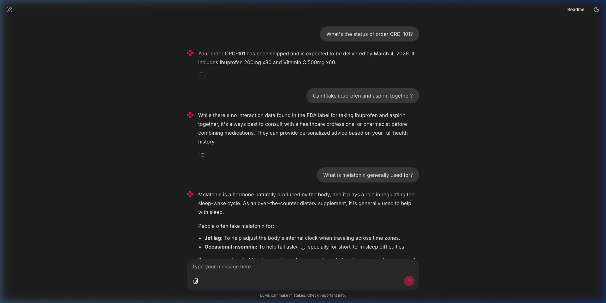
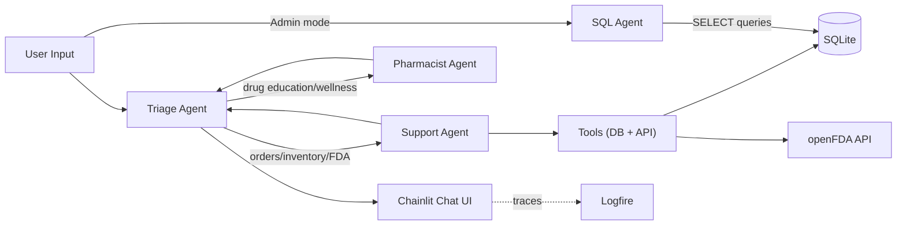

# 💊 Pharmacy Support Agent


An AI-powered **multi-agent** customer support chatbot for an online pharmacy. Features intelligent query routing, streaming responses, interactive quick-actions, a secure **Text-to-SQL admin mode**, and **voice input/output** — built with pydantic-ai and Chainlit.



## Tech Stack

| Component | Technology |
|---|---|
| Language | Python 3.13+ |
| Agent Framework | [Pydantic AI](https://ai.pydantic.dev/) |
| LLM | Google Gemini 2.5 Flash |
| UI | [Chainlit](https://docs.chainlit.io/) |
| Database | SQLite |
| Observability | [Pydantic Logfire](https://logfire.pydantic.dev/) |

## Features

- **Dual Persona Modes** — Toggle between Customer Support and Admin Analyst via Chat Settings
- **Text-to-SQL** — Admin mode converts natural language to SQL queries against the pharmacy database
- **Multi-Agent Architecture** — Triage agent routes queries to specialised support and pharmacist agents
- **Streaming Responses** — Word-by-word output for a responsive chat experience
- **Quick-Action Starters** — Context-aware buttons that change based on the active persona
- **Order Tracking** — Look up order status, items, and expected delivery by order ID
- **Inventory Checks** — Query real-time stock levels for any product
- **Drug Interaction Checker** — Check potential interactions between two medications via the openFDA API
- **FDA Drug Warnings** — Fetch official FDA boxed warnings for specific medications
- **Medical Safety Guardrails** — Declines medical advice requests and directs users to healthcare professionals
- **Voice Mode** — Speak questions via microphone (Gemini STT) and hear answers read aloud (gTTS)
- **Automated Invoicing** — Dynamically calculates totals (in GHS) and generates a downloadable PDF attached inline to the chat
- **SQL Safety Guardrails** — Admin queries restricted to SELECT-only, blocking all write operations
- **Observability** — Full tracing of agent runs, tool calls, and SQLite queries via Logfire

## Architecture



1. User sends a message via the Chainlit chat interface
2. Based on the active persona (set via Chat Settings):
   - **Customer mode** → triage agent routes to Support or Pharmacist
   - **Admin mode** → SQL agent generates and executes queries directly
3. Customer queries are routed to the appropriate specialist:
   - **Support agent** → order tracking, inventory, FDA warnings, drug interactions
   - **Pharmacist agent** → drug education, general wellness, medication info
4. The specialist's response is streamed back to the user word-by-word

## Project Structure

```
pharmacy-agent/
├── agents.py         # Multi-agent definitions (triage, support, pharmacist, SQL)
├── app.py            # Chainlit UI, persona toggle, streaming, starters
├── init_db.py        # Database initialisation & seed data script
├── tools.py          # Tool functions & PharmacyDeps dependency class
├── docs/
│   ├── demo.png
│   └── original-spec.md  # Original POC brief (historical)
├── tests/
│   ├── test_tools.py
│   └── test_app.py
├── .env.example      # Template — copy to .env and fill in your key
├── pyproject.toml    # Project config & dependencies
└── README.md
```

## Quick Start

### Prerequisites

- Python 3.13+
- [uv](https://docs.astral.sh/uv/) package manager
- A [Google AI Studio](https://aistudio.google.com/apikey) API key

### Setup

1. **Clone the repository**
   ```bash
   git clone <repo-url>
   cd pharmacy-agent
   ```

2. **Configure your API key**
   ```bash
   cp .env.example .env
   # Then edit .env and replace the placeholder with your actual key
   ```

3. **Initialise the database**
   ```bash
   uv run python init_db.py
   ```

4. **Run the app**
   ```bash
   uv run chainlit run app.py -w
   ```

   The app will open at [http://localhost:8000](http://localhost:8000).

### Logfire (Optional)

To enable observability tracing, authenticate with Logfire:

```bash
uv run logfire auth
uv run logfire projects use <your-project>
```

Traces will appear at your [Logfire dashboard](https://logfire.pydantic.dev/).

## Available Tools

| Tool | Parameter(s) | Source | Description |
|---|---|---|---|
| `get_order_status` | `order_id` | SQLite | Returns status, items, and delivery date |
| `check_inventory` | `product_name` | SQLite | Returns current stock level |
| `get_fda_warnings` | `drug_name` | openFDA API | Returns FDA boxed warnings |
| `check_drug_interactions` | `drug_name_1`, `drug_name_2` | openFDA API | Returns interaction info for both drugs |
| `prepare_order_cancellation` | `order_id` | SQLite | Stages an order for HITL cancellation |
| `generate_invoice` | `items` | Python / `fpdf2` | Returns a Markdown summary and generates a PDF invoice |
| `execute_sql_query` | `sql_query` | SQLite | Executes read-only SQL (Admin mode only) |

## Mock Data

**Sample Orders:** `ORD-101` through `ORD-105` with statuses including Shipped, Processing, Delivered, and Cancelled.

**Sample Inventory:** Ibuprofen, Vitamin C, Melatonin, Amoxicillin (out of stock), Aspirin, Antihistamine, Cough Syrup, Hand Sanitizer.

## Example Queries

### Customer Mode

| Query | Agent | Expected Behaviour |
|---|---|---|
| *"What's the status of order ORD-101?"* | Support | Calls `get_order_status` → returns shipping details |
| *"Is ibuprofen available?"* | Support | Calls `check_inventory` → returns stock count |
| *"Can I take ibuprofen and aspirin together?"* | Support | Calls `check_drug_interactions` → returns FDA data |
| *"What are the FDA warnings for ibuprofen?"* | Support | Calls `get_fda_warnings` → returns official warnings |
| *"What is melatonin generally used for?"* | Pharmacist | Provides educational info + disclaimer |
| *"What should I take for a headache?"* | Pharmacist | Guardrail activates → declines, suggests a doctor |

### Admin Mode

| Query | Description |
|---|---|
| *"How many orders per status?"* | Counts orders grouped by status |
| *"Which products are out of stock?"* | Finds products with stock = 0 |
| *"Show all shipped orders"* | Lists shipped orders with items and dates |
| *"What is the total inventory?"* | Sums stock across all products |

## License

This project is a Proof of Concept for demonstration purposes.
